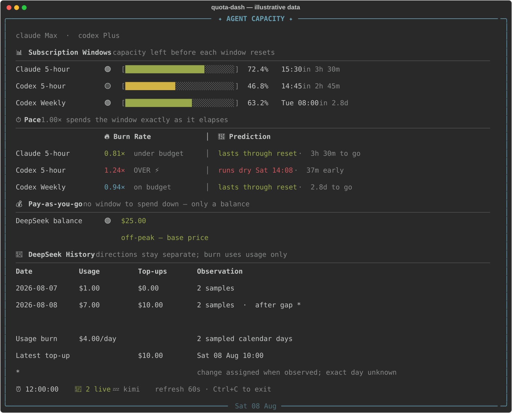

# quota-dash

`quota-dash` is a live terminal dashboard for the capacity available across
your AI coding providers. It puts rolling subscription limits, pace and reset
times next to a DeepSeek prepaid balance, so one glance answers both “how much
room is left?” and “where should the next job run?”



The figures in this screenshot are illustrative; they are generated from
representative data, not a real account. Regenerate it with
`./scripts/render-screenshot` after changing the UI.

## Requirements and installation

- Python 3.9 or newer.
- [`quota-axi`](https://github.com/kunchenguid/quota-axi) on `PATH`, configured
  for the subscription providers you use. Its current package requires Node.js
  22.19 or newer and can be installed with `npm install --global quota-axi`.
- `rich` 13.7.1 or newer. It is the only third-party Python import.

Clone the repository, create a virtual environment, and install the Python
dependency:

```sh
git clone https://github.com/rymndcs/quota-dash.git
cd quota-dash
python3 -m venv .venv
. .venv/bin/activate
python -m pip install -r requirements.txt
```

Authenticate `quota-axi` separately with `quota-axi auth`, then run the
dashboard. The optional argument is the refresh interval in seconds (default:
60):

```sh
./quota-dash
./quota-dash 30
```

When the dashboard is taller than the terminal, scroll with Up/Down (or `k`/`j`),
PgUp/PgDn, and Home/End. The position bar at the bottom shows which lines are
visible. Exit with Ctrl+C. Keep the virtual environment active when running the
script, or install `rich` into whichever Python environment resolves as
`python3`.

## Providers and credentials

`quota-axi` supplies the subscription providers it supports, including Claude,
Codex, Cursor, Copilot, Grok and Kimi. Their limits are rolling windows: the
dashboard shows remaining percentages, reset times, burn pace and whether the
current pace is likely to exhaust a window early.

DeepSeek is different. It is pay-as-you-go rather than a subscription window,
so `quota-dash` calls DeepSeek's balance endpoint directly and shows the
remaining USD credit and observed usage/top-ups. DeepSeek is optional: with no
key, the complete dashboard still renders and shows a dim “no key configured”
placeholder.

Put the DeepSeek key in `~/.quota-dash/auth.json`:

```json
{
  "deepseek": {
    "key": "YOUR_DEEPSEEK_API_KEY"
  }
}
```

Protect it with `chmod 600 ~/.quota-dash/auth.json`. For compatibility with
existing installations, the script falls back to `~/.pi/agent/auth.json` when
the new file has no usable key and displays a one-line migration hint. It does
not copy the credential automatically, and it never prints the key.

## History and accounting

Every successful DeepSeek refresh appends the three USD balance components to
`~/.cache/quota-dash/history.jsonl`. Failed or malformed reads are not recorded.
Set `QUOTA_DASH_HISTORY` to override that location. The default file is created
with mode `0600` inside a mode `0700` directory; history, credentials and local
caches are gitignored.

The history math deliberately treats the two provider models differently:

- A subscription window is rolling and resets. Its percentage is a level, not
  a total, so percentages cannot be summed. Consumption is represented by
  positive changes between samples; resets must not look like capacity being
  “unspent.”
- A prepaid balance has the opposite shape. Decreases in either the granted or
  topped-up component are usage, while increases in the topped-up component are
  top-ups. Sampling cannot separate spend and a top-up that happen in the same
  component between two samples; only their net change is observable.
- History is only as complete as the times the dashboard was open. Work done
  while it was closed creates a gap, not a known zero. A change after a gap is
  assigned to the day it was observed and marked rather than presented as
  exact calendar-day data.

## License

MIT. See [LICENSE](LICENSE).
